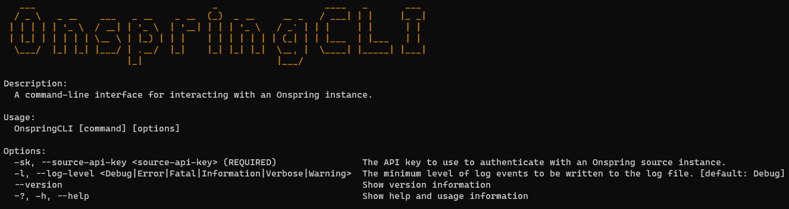

# Onspring CLI

[](https://github.com/StevanFreeborn/OnspringCLI/actions/workflows/build_test.yml)
[](https://codecov.io/gh/StevanFreeborn/OnspringCLI)
[](https://github.com/StevanFreeborn/OnspringCLI/actions/workflows/publish_release.yml)


[](https://github.com/semantic-release/semantic-release)

OnspringCLI is a command line app for interacting with an [Onspring](https://onspring.com/) instance. The app provides a set of commands that can be run from the command line. The commands use the [Onspring API](https://api.onspring.com/swagger/index.html) to execute actions against content in an Onspring instance.



## Installation

The app is published [here](https://github.com/StevanFreeborn/OnspringCLI/releases) on Github as a release where you can download it as a single executable file for the following operating systems:

- win-x64
- linux-x64
- osx-x64 (Minimum OS version is macOS 10.12 Sierra)

**Notes:**

- After downloading the executable you may need to run `chmod +x` to give the executable execute permissions on your machine.
- After downloading the executable you may need to provide permission for the application to run via the your systems settings.

You are also welcome to clone this repository and run the app using the [.NET 7](https://dotnet.microsoft.com/en-us/download) tooling and runtime. As well as modify the app further for your specific needs.

## Commands

- **Attachments** - Commands for working with attachments in an Onspring instance.
  - **Download**
    - **Bulk** - Download all attachments from fields on records in an app. See [Bulk Download Attachments](https://github.com/StevanFreeborn/OnspringCLI/wiki/Attachments-Download-Bulk) for more information.
  - **Delete**
    - **Bulk** - Delete all attachments from fields on records in an app. See [Bulk Delete Attachments](https://github.com/StevanFreeborn/OnspringCLI/wiki/Attachments-Delete-Bulk) for more information.
  - **Transfer** - Transfer attachments from fields on records in one app to fields on records in another app. See [Transfer Attachments](https://github.com/StevanFreeborn/OnspringCLI/wiki/Attachments-Transfer) for more information.
  - **Report** - Generate a report of attachments in an app. See [Attachment Report](https://github.com/StevanFreeborn/OnspringCLI/wiki/Attachments-Report) for more information.

**Note:** The app will prompt you for any required information that is not provided via the command line.

## Global Options

- **Api Key:** `--source-api-key` or `-sk`
  - Allows you to specify an Api Key to use when making requests to the source Onspring API.
  - **Example usage:** `onspringcli.exe -sk 000000ffffff000000ffffff/00000000-ffff-0000-ffff-000000000000`
- **Log Level:** `--log` or `-l`
  - Allows you to specify what the minimum level of event that will be written to the log file while the app is running.
  - By default this will be set to the `Debug` level.
  - The valid levels are: `Debug` | `Error` | `Fatal` | `Information` | `Verbose` | `Warning`
  - **Example usage:** `onspringcli.exe -l fatal`
- **Help:** `--help` or `-h`
  - Can be passed to any command to get more detail about the command and its arguments and/or options.
  - **Example usage:** `onspringcli.exe attachments -h`

## ApiKey

This app makes use of version 2 of the Onspring API. Therefore to run a particular command you will need an API Key. API keys may be obtained by an Onspring user with permissions to at least read API Keys for your instance, using the following instructions:

- Within Onspring, navigate to /Admin/Security/ApiKey.
- On the list page, add a new API Key (requires Create permissions) or click an existing API Key to view its details.
- On the details page for an API Key, click on the Developer Information tab.
- Copy the X-ApiKey Header value from this section.

_**Important:**_

- An API Key must have a status of Enabled in order to be used.
- Each API Key must have an assigned Role. This role controls the permissions for requests that are made by this tool to access content. If the API Key does not have sufficient permissions to the content the app may not be able to complete the command executed successfully.

### Permission Considerations

You can think of any API Key as another user in your Onspring instance and therefore it is subject to all the same permission considerations as any other user when it comes to it's ability to access a content. The API Key you use with this app needs to have all the correct permissions within your instance to access the content that the command you are executing acts upon. Things to think about in this context are `role permissions`, `content security`, and `field security`.

### API Usage Considerations

This app uses version 2 of the Onspring API to interact with content within an instance. Currently this version of the Onspring API does not provide any endpoints to perform bulk operations.

This app will make a number of api requests to Onspring in order to execute any given command. These requests can include:

- collecting all the fields in an app
- collecting all the records in an app
- collecting all the files in an app
- etc.

The total number of requests will vary depending on the command you are executing and the options provided.

This all being shared because it is important you take into consideration the number of requests that may be made on your behalf when executing the command. If you believe the quantity is quite considerable I'd encourage you to consult with your Onspring representative to understand what if any limits there are to your usage of the Onspring API.

## Logging

In addition to the information the app will log out to the console as it is running and any artifacts a particular command produces a log file will also be written to a folder named `logs`. This log can be used to review the work done and troubleshoot any issues the app may have encountered while executing a particular command. Please note that each log event is written in [Compact Log Event Format](http://clef-json.org/). You are welcome to parse the log file in the way that best suits your needs.

Various tools are available for working with the CLEF format.

- [Analogy.LogViewer.Serilog](https://github.com/Analogy-LogViewer/Analogy.LogViewer.Serilog) - CLEF parser for Analogy Log Viewer
- [clef-tool](https://github.com/datalust/clef-tool) - a CLI application for processing CLEF files
- [Compact Log Format Viewer](https://github.com/warrenbuckley/Compact-Log-Format-Viewer) - a cross-platform viewer for CLEF files
- [Seq](https://datalust.co/seq) - import, search, analyze, and export application logs in the CLEF format
- [seqcli](https://github.com/datalust/seqcli) - pretty-print CLEF files at the command-line

Example log messages:

```json
{"@t":"2023-03-24T03:51:58.9461508Z","@mt":"Starting Onspring Attachment Reporter.","SourceContext":"OnspringCLI.Commands.Attachments.ReportCommand+Handler"}
{"@t":"2023-03-24T03:51:58.9599285Z","@mt":"Retrieving file fields.","SourceContext":"OnspringCLI.Commands.Attachments.ReportCommand+Handler"}
{"@t":"2023-03-24T03:52:00.0250055Z","@mt":"File fields retrieved. {Count} file fields found.","Count":5,"SourceContext":"OnspringCLI.Commands.Attachments.ReportCommand+Handler"}
{"@t":"2023-03-24T03:52:00.0272159Z","@mt":"Retrieving files that need to be requested.","SourceContext":"OnspringCLI.Commands.Attachments.ReportCommand+Handler"}
{"@t":"2023-03-24T03:52:00.1473389Z","@mt":"Files retrieved. {Count} files found.","Count":20,"SourceContext":"OnspringCLI.Commands.Attachments.ReportCommand+Handler"}
{"@t":"2023-03-24T03:52:00.1477405Z","@mt":"Retrieving information for each file.","SourceContext":"OnspringCLI.Commands.Attachments.ReportCommand+Handler"}
{"@t":"2023-03-24T03:52:04.5415154Z","@mt":"File info retrieved for {Count} of {Total} files.","Count":20,"Total":20,"SourceContext":"OnspringCLI.Commands.Attachments.ReportCommand+Handler"}
{"@t":"2023-03-24T03:52:04.5417431Z","@mt":"Start writing attachments report.","SourceContext":"OnspringCLI.Commands.Attachments.ReportCommand+Handler"}
{"@t":"2023-03-24T03:52:04.5909575Z","@mt":"Finished writing attachments report:","SourceContext":"OnspringCLI.Commands.Attachments.ReportCommand+Handler"}
{"@t":"2023-03-24T03:52:04.5912271Z","@mt":"Onspring Attachment Reporter finished.","SourceContext":"OnspringCLI.Commands.Attachments.ReportCommand+Handler"}
```
